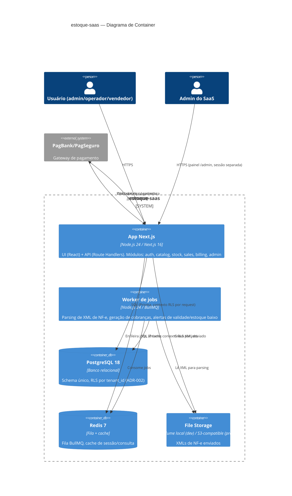

# C4 — Container

## Notas
- `web` e `worker` compartilham a mesma imagem Docker e base de código (monolito modular, ADR-001); diferem apenas no `CMD` de entrada.
- Nenhum container tem acesso direto à internet exceto `web` (inbound) e as chamadas outbound de `web`/`worker` ao PagBank — superfície de ataque mínima.
- Em produção (VPS via Docker Compose), todos os containers compartilham uma rede Docker privada; apenas `web` expõe porta pública (atrás de um reverse proxy/TLS, fora do escopo desta arquitetura de aplicação — tratado no SHIP).
