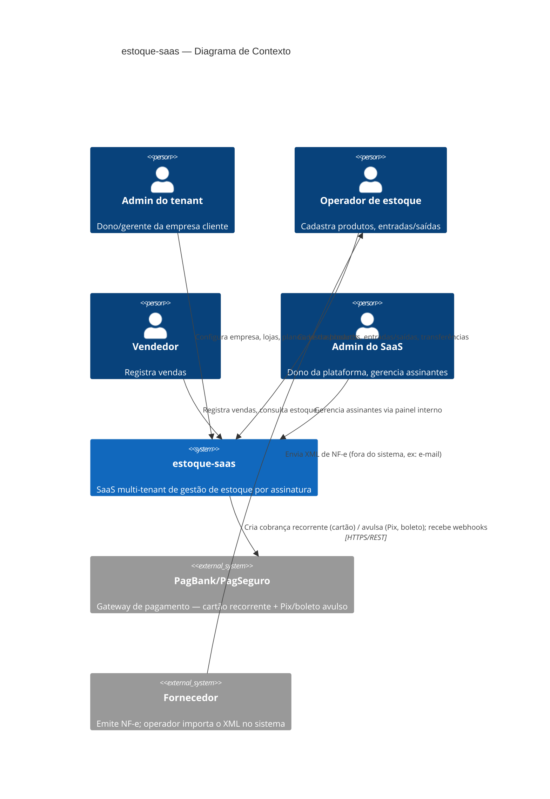

# C4 — Contexto do Sistema

## Atores e sistemas externos
- **Admin do tenant / Operador / Vendedor**: usuários finais do produto, dentro de uma empresa cliente (tenant).
- **Admin do SaaS**: usuário interno, dono da plataforma, opera o painel administrativo separado.
- **PagBank/PagSeguro**: único sistema externo de pagamento (ADR-004), acessado via `PaymentProvider`.
- **Fornecedor**: não integra diretamente ao sistema — o XML de NF-e chega por fora (e-mail, download do portal do fornecedor) e é importado manualmente pelo operador (ADR-005).
