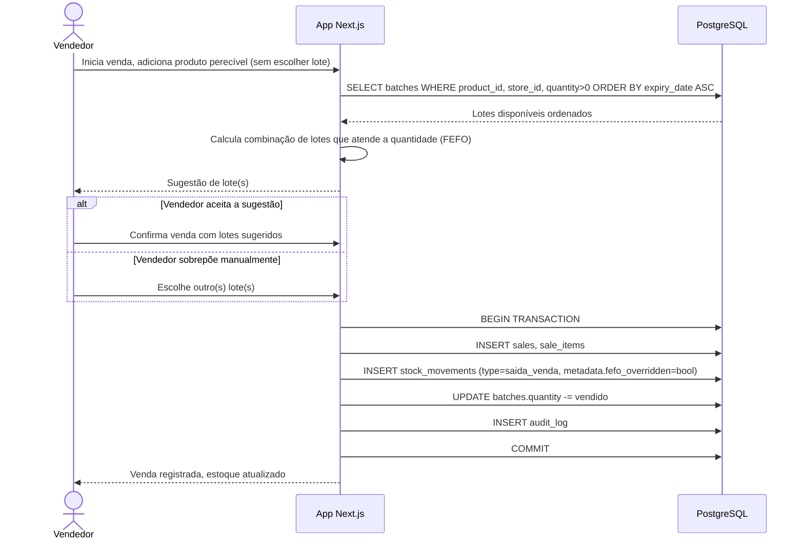

# Sequência — Venda com sugestão FEFO

```mermaid
sequenceDiagram
    actor Vendedor
    participant Web as App Next.js
    participant DB as PostgreSQL

    Vendedor->>Web: Inicia venda, adiciona produto perecível (sem escolher lote)
    Web->>DB: SELECT batches WHERE product_id, store_id, quantity>0 ORDER BY expiry_date ASC
    DB-->>Web: Lotes disponíveis ordenados
    Web->>Web: Calcula combinação de lotes que atende a quantidade (FEFO)
    Web-->>Vendedor: Sugestão de lote(s)

    alt Vendedor aceita a sugestão
        Vendedor->>Web: Confirma venda com lotes sugeridos
    else Vendedor sobrepõe manualmente
        Vendedor->>Web: Escolhe outro(s) lote(s)
    end

    Web->>DB: BEGIN TRANSACTION
    Web->>DB: INSERT sales, sale_items
    Web->>DB: INSERT stock_movements (type=saida_venda, metadata.fefo_overridden=bool)
    Web->>DB: UPDATE batches.quantity -= vendido
    Web->>DB: INSERT audit_log
    Web->>DB: COMMIT
    Web-->>Vendedor: Venda registrada, estoque atualizado
```
