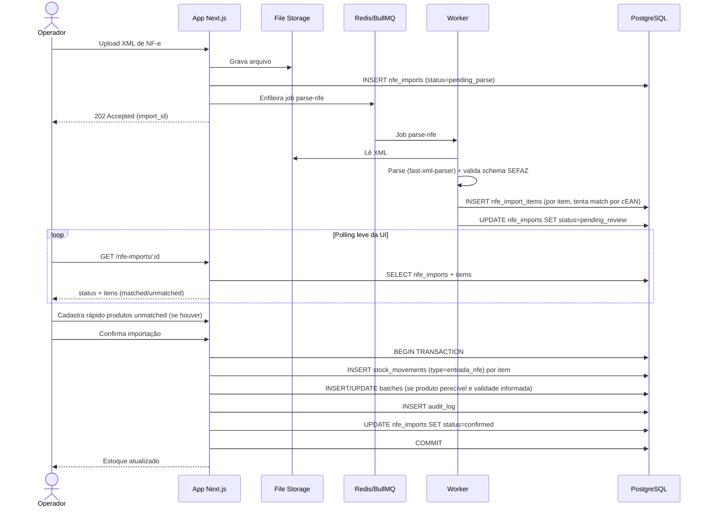

# Sequência — Importação de XML de NF-e

Cobre o Pattern 5 do boundary-safety protocol: o teste e2e desta jornada verifica o estado final (saldo de estoque atualizado), não apenas que cada chamada individual retornou 200.
