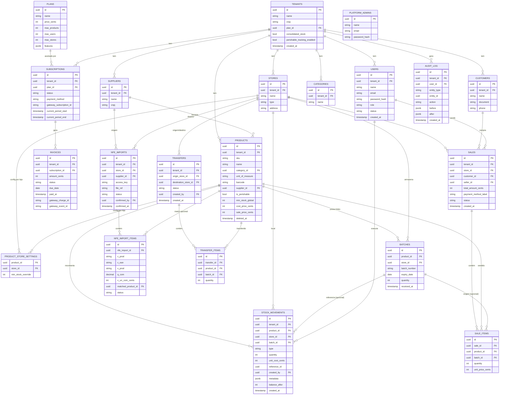

# ERD — estoque-saas

Todas as tabelas marcadas `[tenant]` têm `tenant_id` e RLS habilitada (ADR-002). Tabelas sem a marca são globais (fora do RLS de tenant).

## Notas de modelagem
- **Saldo de estoque** não é uma tabela própria materializada separadamente — é derivado somando `stock_movements.quantity` (com sinal) por `product_id + store_id`, e cada movimento grava `balance_after` para leitura rápida sem recomputar a soma inteira a cada consulta (trade-off: leve redundância controlada, não fonte de verdade dupla — `balance_after` é sempre recalculável a partir do histórico).
- `stock_movements.reference_id` aponta para `sales.id`, `transfers.id` ou `nfe_imports.id` dependendo do `type` — polimorfismo simples via UUID + `type`, sem FK direta (documentado, validado em nível de aplicação e coberto por teste).
- `PLANS` e `PLATFORM_ADMINS` são as únicas tabelas sem `tenant_id` — não participam do RLS de tenant (ADR-002).
- Todas as tabelas `[tenant]` (todas exceto `PLANS` e `PLATFORM_ADMINS`) têm `tenant_id` direto, mesmo quando alcançável via join (ex: `stock_movements.tenant_id` mesmo existindo `product_id → products.tenant_id`) — decisão da ADR-002 para manter a política RLS auto-contida.
